# Cart-Pole
Cart-pole is a classical example in non-linear dynamics and control theory. The system consists of a cart that is free to move along the ground, with a pendulum attached to it (as illustrated below). 

This repository is a Python playground for the cart-pole system. The majority of the project is implemented from scratch, and many of the equations used are derived in `dynamics.ipynb`.

The primary focus of the repo is to prototype and compare controllers that balance the pole upright, a non trivial problem because the upright configuration is an unstable equilibrium (see below). Implemented approaches include:
- [Reinforcement learning (RL)](#rl)
  - Q-learning
  - Deep Q-Network (DQN)
- [Classical controllers](#classical-controllers)
  - Linear quadratic regulator (LQR)
  - Energy-based controlling
  - Hybrid controlling

<table width="100%">
  <tr>
    <th width="50%">System overview</th>
    <th width="50%">Passive dynamics - starting with a pole angle of 0.01 rad</th>
  </tr>
  <tr>
    <td>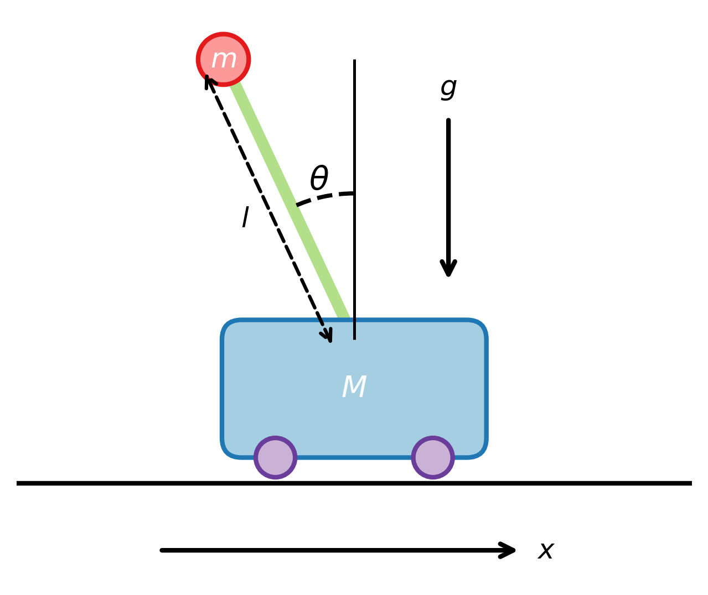</td>
    <td>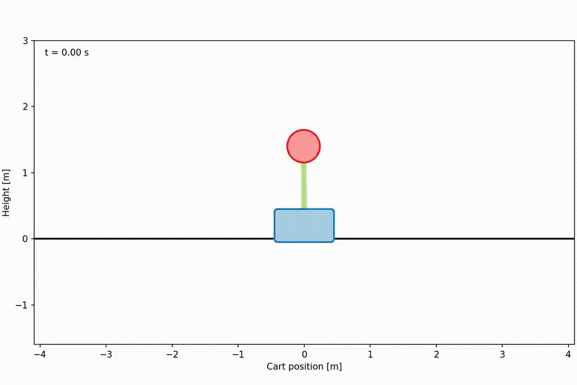</td>
  </tr>
</table>


## Reinforcement learning <a name="rl"></a>
Reinforcement learning is a branch of machine learning where an agent learns a policy (a decision-making rule) by interacting with an environment, receiving feedback through rewards and improving via trial and error.

### Q-learning <a name="q-learning"></a>
I implemented tabular Q-learning from scratch and trained it to balance the pole while keeping the cart near the origin. Unlike classical controllers, the Q-learning agent uses discretized state and action spaces. It can apply only a fixed force to the left or right, which yields less smooth trajectories than controllers with continuous actions. Below is a Q-learning policy with two actions, trying to handle the initial state
`[1.2, 0.1, 0.2, 0.1 ]`.

<div align="center">
  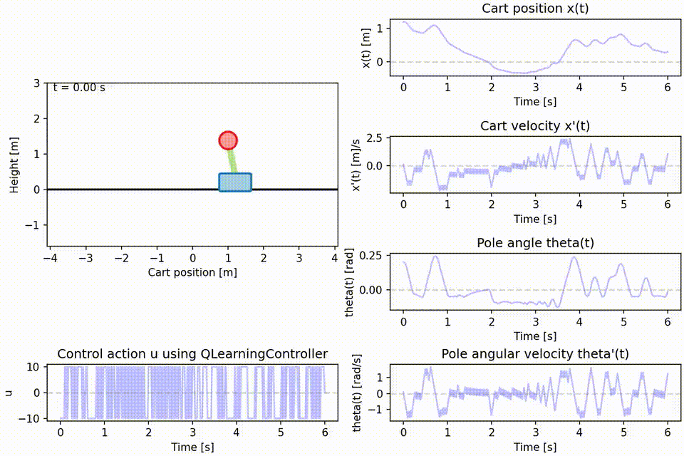
</div>

### Deep Q-Network (DQN)
The DQN agent uses a neural network to approximate the Q-function over a continuous state space, in contrast to Q-learning which operates with a discrete state space, while still having a discrete set of actions to choose from. DQN is better suited to handle more actions and therefore it is able to control the cart more smoothly. Below is a DQN policy trained with four actions, trying to handle the initial state
`[3, 0, 0.8, 0]`.

<div align="center">
  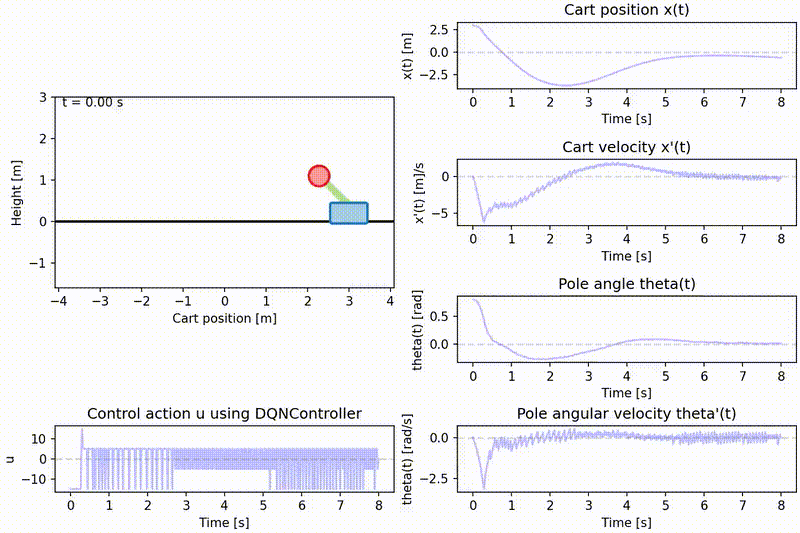
</div>

## Classical Controllers <a name="classical-controllers"></a>
Classical controllers are derived from an analytic model of the system’s dynamics.

- **LQR.** A locally optimal state-feedback controller designed on the dynamics linearized about the upright configuration ($\theta=0$). It performs well when the pole is already near upright, but is unstable as $\theta \gg 0$.

- **Energy-based (swing-up).** Drives the pendulum's energy toward a target equal to the upright potential energy, while also trying to keep the cart near the origin ($x\approx 0$). This approach can reliably 'swing up' from a broad set of initial conditions, but it does not stabilize in the upright equilibrium; it gets the pole close to the top but won’t balance it.

- **Hybrid (switching).** A controller that switches between the energy based controller and LQR as it sees fit.

To illustrate behavior, the controllers are compared side by side below subject to two different initial conditions.

### Near Upright (disturbed but recoverable)
Initial state `[−2.0, 1.0, 0.5, 0.6]` for $[x, \dot{x}, \theta, \dot{\theta}]$. The cart starts far from the origin with noticeable velocity, and the pole is slightly off balance.  
- **LQR** handles this case well, as expected in its region of validity.  
- **Energy-based** maintains large swings while roughly keeping the cart near 0, but it does not capture and balance the upright.  
- **Hybrid** uses the energy policy to manage swing dynamics, then switches to LQR near upright to settle and balance.

<table width="100%">
  <tr>
    <th width="50%">Passive dynamics</th>
    <th width="50%">LQR</th>
  </tr>
  <tr>
    <td></td>
    <td>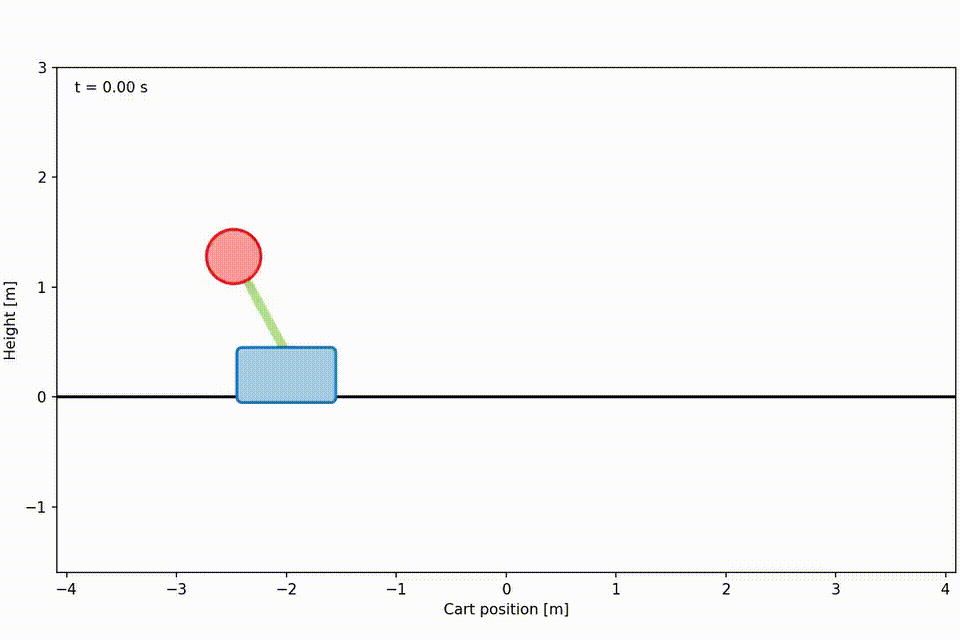</td>
  </tr>
  <tr>
    <th>Energy-based</th>
    <th>Hybrid</th>
  </tr>
  <tr>
    <td>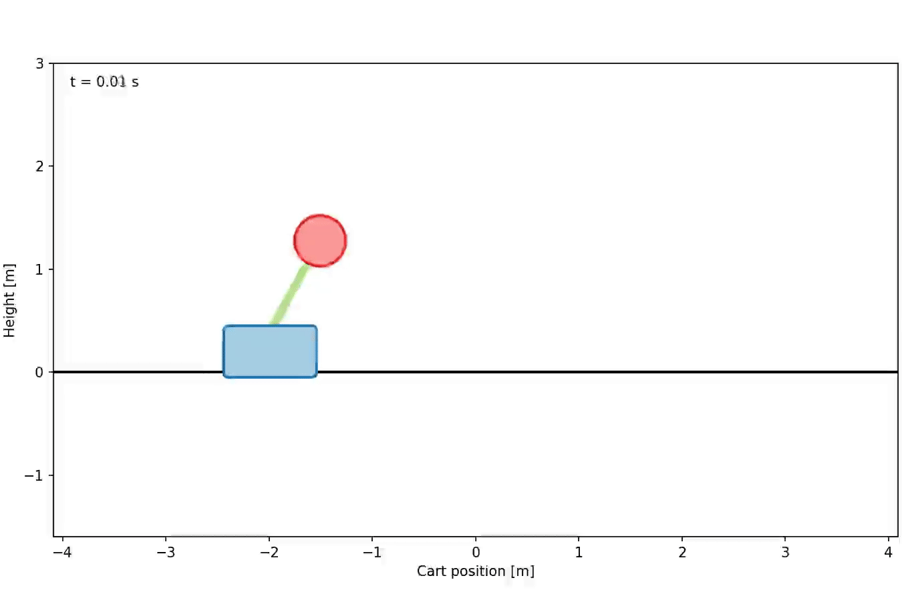</td>
    <td>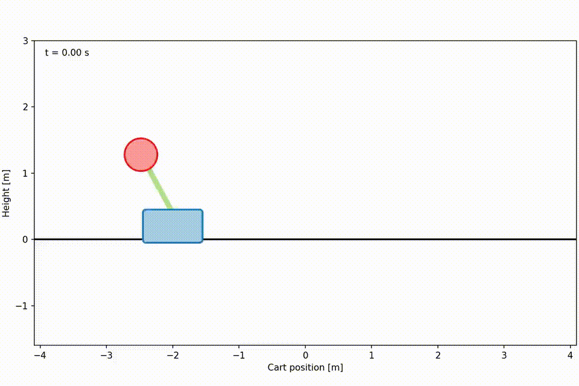</td>
  </tr>
</table>

### Near Downward (swing-up required)
Initial state `[0.1, −0.3, 2.8, −0.5]` for $[x, \dot{x}, \theta, \dot{\theta}]$. The cart is nearly at rest.

- **LQR** is designed around the upright position and is unstable this far from θ = 0.
- **Energy-based** behaves as in the previous case: it injects/extracts energy to build a large swing while trying to keep the cart near the origin, but it does not balance upright.
- **Hybrid** uses energy-based swing-up to approach a neighborhood of $\theta=0$, then switches to LQR to stabilize once close to upright conditions are met.

<table width="100%">
  <tr>
    <th width="50%">Passive dynamics</th>
    <th width="50%">LQR (fails far from equilibrium)</th>
  </tr>
  <tr>
    <td></td>
    <td>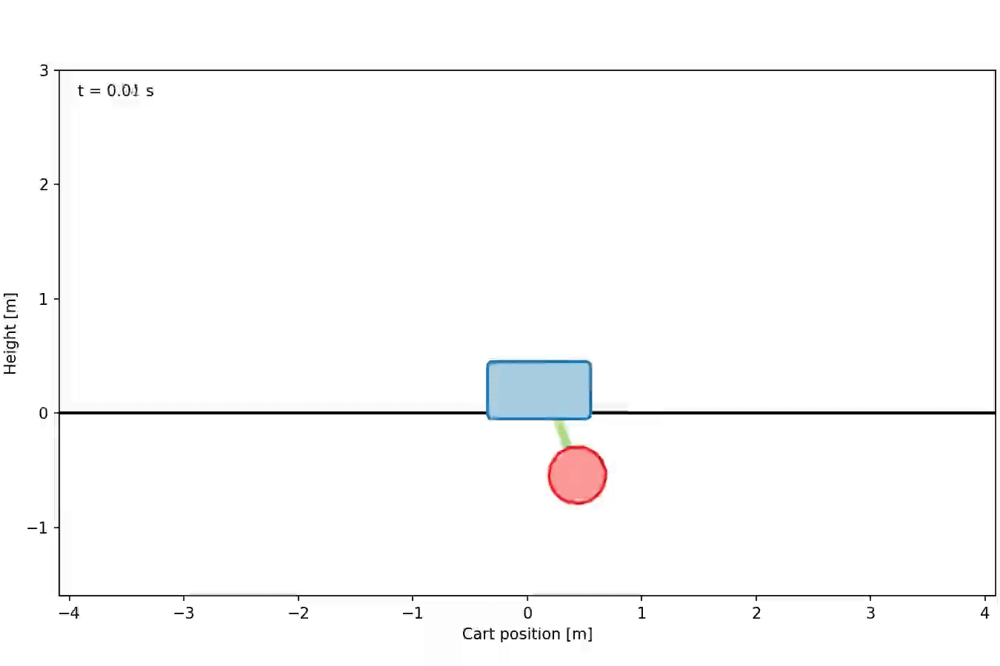</td>
  </tr>
  <tr>
    <th>Energy-based</th>
    <th>Hybrid</th>
  </tr>
  <tr>
    <td>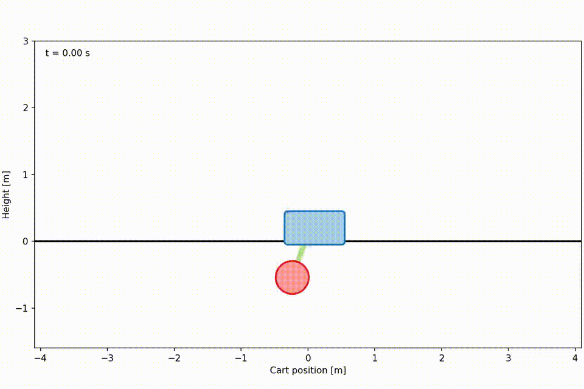</td>
    <td>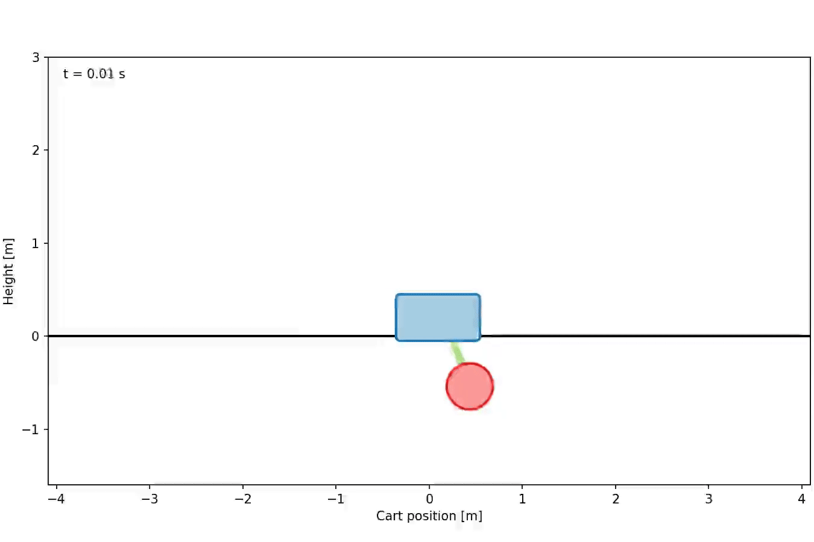</td>
  </tr>
</table>

As can be seen from these two cases, the LQR and energy controllers are suited to handle different operating conditions. Below, the first video demonstrates that the hybrid controller can outperform LQR, even when LQR is able to balance the pole. A second video visualizes the control input/action from the hybrid policy, clearly showing the switch from energy-based to LQR controlling.
<table width="100%">
  <tr>
    <th>LQR</th>
    <th>Hybrid</th>
  </tr>
  <tr>
    <td></td>
    <td>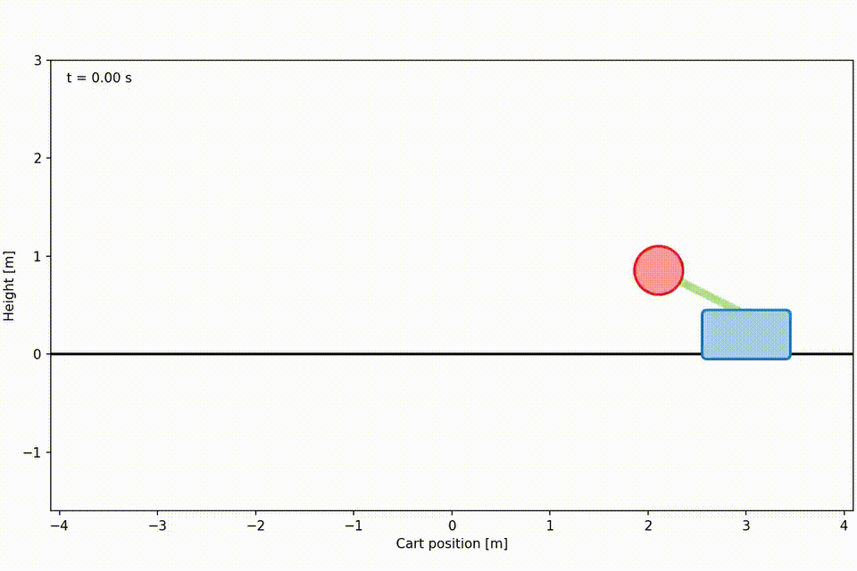</td>
  </tr>
</table>
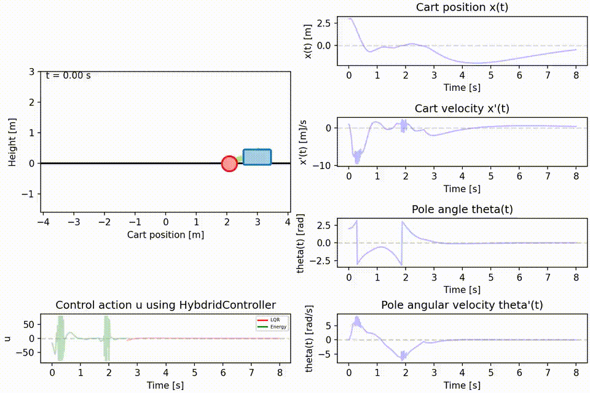</td>


## Installation
- Install Python 3.8+ 
- Clone the repository and install dependencies:
  ```bash
  git clone https://github.com/Martin-Ansteensen/cart-pole.git
  cd cart-pole
  pip install .
  ```

## Running Simulations
- Launch the main driver, used for simulating the response of different controllers, with:
  ```bash
  cart-pole-run
  ```
  Get help by providing `--help`:
  ```bash
  cart-pole-run --help
  ```
- Useful flags:
  - `--initial-state` to supply $x$, $\dot{x}$, $\theta$, $\dot{\theta}$.
  - `--duration` and `--dt` to control simulation length and step size.
  - `--physical` / `--controller` / `--controller-profile` to pick presets defined in `configs.json`.
  - `--list` to print all available presets.
  - `--plots` when you want plots in addition to the animation to gain more insight into simulation.

  To get help with training new Q-learning policies, run:
  ```bash
  cart-pole-train-q train --help
  ```
  The same applies for DQN:
  ```bash
  cart-pole-train-dqn train --help
  ```
  All of the training parameters are not exposed through the CLI, so if you want to tune those you need to change the code.


## Exporting Demonstration Videos
- Supply a path (with filename, but no extension) with `--save-path`
- Recreate the showcase animations:
  ```bash
  # Near upright initial condition
  cart-pole-run --controller none --duration 8 --initial-state -2 1 0.5 0.6 --trace-tip --save-path media/upright_none
  cart-pole-run --controller lqr --duration 8 --initial-state -2 1 0.5 0.6 --trace-tip --save-path media/upright_lqr
  cart-pole-run --controller energy --duration 8 --initial-state -2 1 0.5 0.6 --trace-tip --save-path media/upright_energy
  cart-pole-run --controller hybrid --duration 8 --initial-state -2 1 0.5 0.6 --trace-tip --save-path media/upright_hybrid

  # Near downward initial condition
  cart-pole-run --controller none --duration 8 --initial-state 0.1 -0.3 2.8 -0.5 --trace-tip --save-path media/downright_none
  cart-pole-run --controller lqr --duration 8 --initial-state 0.1 -0.3 2.8 -0.5 --trace-tip --save-path media/downright_lqr
  cart-pole-run --controller energy --duration 8 --initial-state 0.1 -0.3 2.8 -0.5 --trace-tip --save-path media/downright_energy
  cart-pole-run --controller hybrid --duration 8 --initial-state 0.1 -0.3 2.8 -0.5 --trace-tip --save-path media/downright_hybrid

  cart-pole-run --controller lqr --duration 5 --initial-state 3 1 1.1 0 --trace-tip --save-path media/lqr_almost_unstable
  cart-pole-run --controller hybrid --duration 5 --initial-state 3 1 1.1 0 --trace-tip --save-path media/hybrid_very_stable
  # Hybrid controller with plots
  cart-pole-run --controller hybrid --duration 4 --initial-state -3 2 1.8 2 --plots --trace-tip --save-path media/hybrid_plots

  # Tabular Q-learning
  cart-pole-run --controller q_learning --duration 6 --initial-state 1.2 0.1 0.2 0.1 --plots --trace-tip --save-path media/highlight_q_learning

  # Deep Q-Network
  cart-pole-run --controller dqn --duration 8 --dt 0.02 --initial-state 3 0 0.8 0 --plots --trace --save-path media/dqn_highlight
  ```

## Testing
- Various tests to uncover bugs and errors are implemented in `tests/`. Run them with:
  ```bash
  python3 -m unittest
  ```
