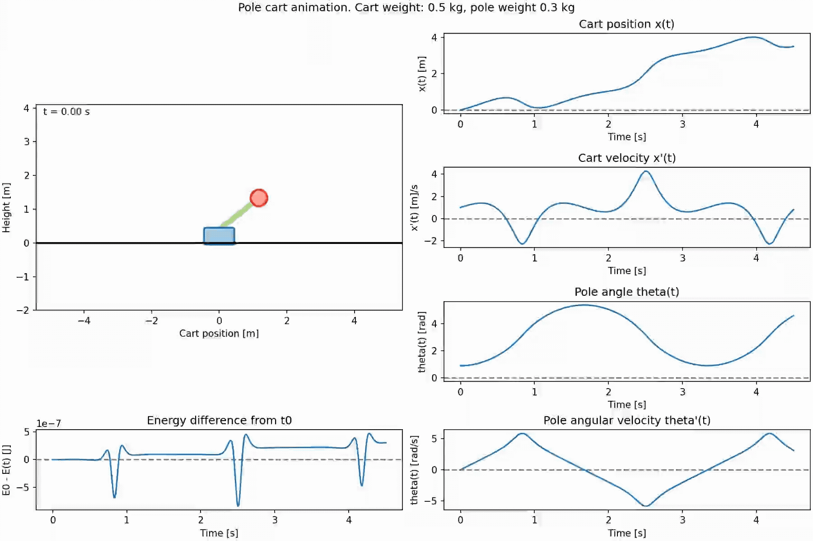
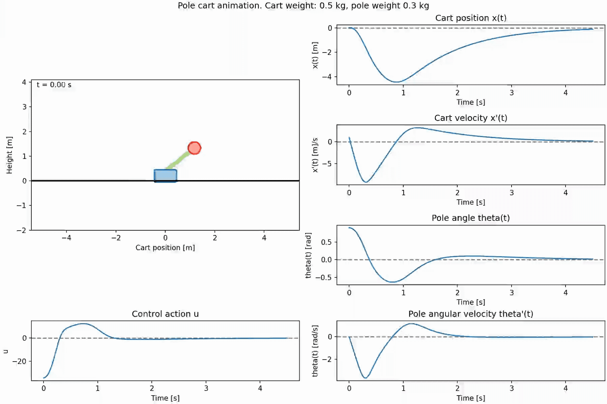

# cart-pole
Cart pole is a classical example in dynamical systems and control theory. This project will implement a simulation of such system subject to friction, disturbances and a controller. Both classical control theory and reinforcment learning will be applied as solutions to control the cart.

Below is a simulation of the cart without any friction, distrubances or controller


And here is a simulation of the cart with the same inital conditions as in the video above, but with an LQR controller affecting it.


## Code overview
The non-linear differential equations for the dynamics are defined in [dynamics.ipynb](dynamics.ipynb). The notebook useses symbolic expressions to define the dynamics and to linearize them. Equations that are useful to the simulation are exported to dynamics.pkl.

The code in dynamics.py imports the .pkl file with the symbolic expressions, inserts constants (like mass and pole length) for the physical paramaters in the equations. The rest of the parameters are set by converting the symbolic expression to a function that can be re-evaluted (with parameters like the state and control action).

The system is simulated by using 4th-order Runge-Kutta method. Based on the tests written using python's builtint `unittest`, this method
seems to simulate the system well with the paramters chosen; the energy in the system stays roughly constant.

The LQR controller is implemented by utilizing the equations from [dynamics.ipynb](dynamics.ipynb). Due to the symbolic implementation, the equations used in forming a state space formulation for the system can easily be calculated and later converted to functions used by the LQR regulator. By using `scipy` to solve the [Algebraic RIccati equation](https://en.wikipedia.org/wiki/Algebraic_Riccati_equation), the code is able to obtain the optimal gain matrix $K$. This matrix is used in the control law in the LQR regulator.

The simulation is visualized using `matplotlib`.

## Installation
Copy the the repo to your machine
```
git clone https://github.com/Martin-Ansteensen/cart-pole.git
```
Go into the project folder and install the python package
```
pip3 install -e .
```

## Usage
Run main.py to see a simulation
