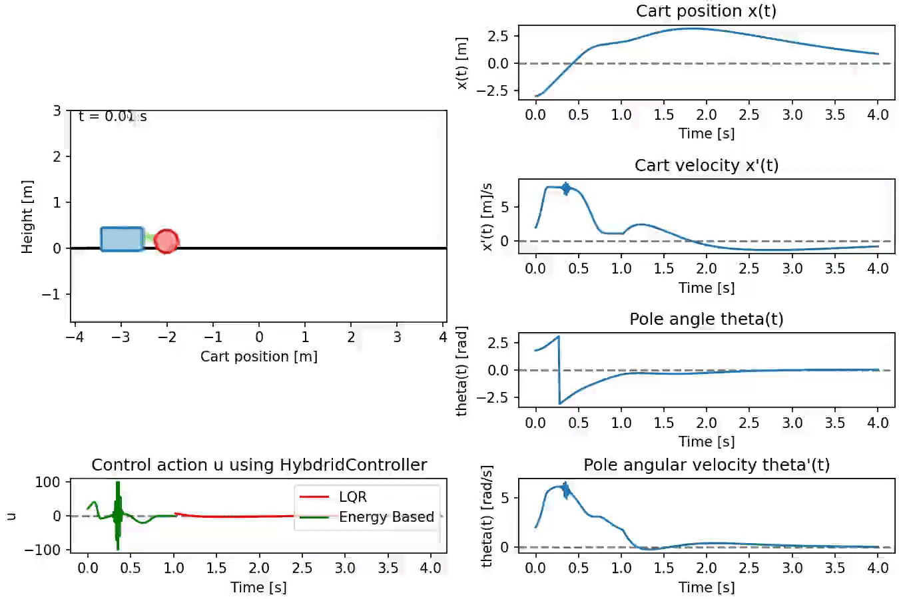

# Cart-Pole Control Sandbox

A Python playground for studying the classic cart-pole problem with non-linear dynamics, energy control, linear-quadratic (LQR) balancing and reinforcement learning. The codebase lets you simulate different controller strategies, compare their behaviour, and export videos of the motion.

The system we are dealing with is shown below. Positive $x$ is measured to the right along the track. The pole angle $\theta$ is measured counter-clockwise from the upright position. The <u>state</u> of the system captures its dynamics at any given point, and we conveniently store the state as a vector: $[x, \dot{x}, \theta, \dot{\theta}]$.

<div align="center">
  
</div>

## Controller Showcases
Two contrasting initial conditions highlight how each controller behaves compared to the passive dynamics. 

### Near Upright (disturbed but recoverable)
Initial state `[-2.0, 1.0, 0.5, 0.6]`. The cart begins far from the origin with noticeable velocity while the pole is nudged off balance. The LQR controller handles this case well, as it should. The energy controller manages to maintain the large pendulum swing while keeping the cart roughly at 0, but is not able to stabilize the pole in the upright position.

<table width="100%">
  <tr>
    <th width="50%">Passive dynamics</th>
    <th width="50%">LQR</th>
  </tr>
  <tr>
    <td></td>
    <td></td>
  </tr>
  <tr>
    <th>Energy based</th>
    <th>Hybrid</th>
  </tr>
  <tr>
    <td></td>
    <td></td>
  </tr>
</table>

### Near Downward (swing-up required)
Initial state `[0.1, -0.3, 2.8, -0.5]`. The cart begins almost at rest in the downwards position. The LQR controller is not able to handle these conditions, as the dynamics at this initial state are very different from the linearized ones the LQR controller operates with. The energy controller performs the same as it did for the prior case.

<table width="100%">
  <tr>
    <th width="50%">Passive dynamics</th>
    <th width="50%">LQR (fails far from equilibrium)</th>
  </tr>
  <tr>
    <td></td>
    <td></td>
  </tr>
  <tr>
    <th>Energy based</th>
    <th>Hybrid</th>
  </tr>
  <tr>
    <td></td>
    <td></td>
  </tr>
</table>

As can be seen from these two cases, the LQR and energy controllers are suited to handle different operating conditions. By combining them into one controller, the Hybdrid one, we get the best of both worlds. Below is a video showcasing the action applied by hybrid controller, where one clearly can see when the controller switches from LQR to energy based controlling:
</td>


## Features
- Non-linear cart-pole dynamics integrated with a fourth-order Runge-Kutta solver.
- Different controllers: LQR, energy based swing-up, and a hybrid strategy.
- A JSON config file with presets for physical parameters and controller gains (`cart_pole/configs.json`).
- Matplotlib animation with optional video export.
- Symbolic derivations (in `dynamics.ipynb`) that showcase the the derivation of equations for the linearized system. These equations are exported to `dynamics.pkl` and used at runtime in the simulation.

## Installation
- Install Python 3.8+ 
- Clone the repository and install dependencies:
  ```bash
  git clone https://github.com/Martin-Ansteensen/cart-pole.git
  cd cart-pole
  pip install .
  ```

## Running Simulations
- Launch the driver script with:
  ```bash
  python3 -m cart_pole.main
  ```
  Get help by providing `--help`:
  ```bash
  python3 -m cart_pole.main --help
  ```

- Useful flags:
  - `--initial-state` to supply $x$, $\dot{x}$, $\theta$, $\dot{\theta}$.
  - `--duration` and `--dt` to control simulation length and step size.
  - `--physical` / `--controller` / `--controller-profile` to pick presets defined in `configs.json`.
  - `--list` to print all available presets.
  - `--plots` when you want plots in addition to the animation to gain more insight into simulation.

## Exporting Demonstration Videos
- Supply a base filename with `--save-path`; the writer appends the playback FPS (for example `media/upright_lqr_100fps.mp4`).
- Recreate videos in this README:
  ```bash
  # Near upright initial condition
  python3 -m cart_pole.main --controller none --duration 8 --initial-state -2 1 0.5 0.6 --save-path media/upright_none
  python3 -m cart_pole.main --controller lqr --duration 8 --initial-state -2 1 0.5 0.6 --save-path media/upright_lqr
  python3 -m cart_pole.main --controller energy --duration 8 --initial-state -2 1 0.5 0.6 --save-path media/upright_energy
  python3 -m cart_pole.main --controller hybrid --duration 8 --initial-state -2 1 0.5 0.6 --save-path media/upright_hybrid

  # Near downward initial condition
  python3 -m cart_pole.main --controller none --duration 8 --initial-state 0.1 -0.3 2.8 -0.5 --save-path media/downright_none
  python3 -m cart_pole.main --controller lqr --duration 8 --initial-state 0.1 -0.3 2.8 -0.5 --save-path media/downright_lqr
  python3 -m cart_pole.main --controller energy --duration 8 --initial-state 0.1 -0.3 2.8 -0.5 --save-path media/downright_energy
  python3 -m cart_pole.main --controller hybrid --duration 8 --initial-state 0.1 -0.3 2.8 -0.5 --save-path media/downright_hybrid

  # Animation with plots
  python3 -m cart_pole.main --controller hybrid --duration 4 --initial-state -3 2 1.8  2 --plots --save-path ./media/hybrid_plots
  ```

## Testing
- Various tests to uncover bugs and errors are implemented in `tests/`. Run them with:
  ```bash
  python3 -m unittest
  ```