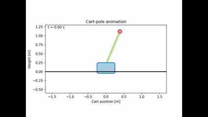

# cart-pole
Cart pole is a classical example in dynamical systems and control theory. This project will implement a simulation of such system subject to friction, disturbances and a controller. Both classical control theory and reinforcment learning will be applied as solutions to control the cart.

Below is a simulation of the cart without any friction, distrubances or controller

